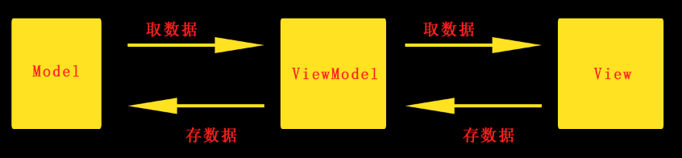

# Vue.js
## 框架与库之间的区别
* 框架：完成的技术解决方案，对项目的侵入性大，想换很难
* 库：提供某一小功能，对项目侵入性小，容易切换
* 库为兼容，框架为DOM与数据
***
## Vue.js有一个宗旨：减少不必要的DOM操作
***
首先在html页面中引用vue.js文件

```
<script src="https://cdn.jsdelivr.net/npm/vue/dist/vue.js"></script>
```
***
## 作为一个MVVC框架:分为M（model），V（View），VM（ViewModel)
* M：保存的是每个页面中的独立数据
* VM：调度者，分割了M和V。每当V层想要获取保存的数据的时候，都要有VM做中间的处理
* V项目中的HTML结构

举个例子：

```
var vm = new Vue({  //创建一个Vue实例
    el: '#app',  //表示Vue实例要控制的区域
    data: {  //存放el中要用到的数据
        msg: '欢迎学习Vue'  //用Vue指令可以把数据渲染到页面上
    }
})
```

以上代码中，data就是MVVM中的M，new出来的对象就是VM，html页面就是V
***
## 指令
`v-cloak`能够解决插值表达式闪烁问题。在样式中添加`[v-cloak]{display:none;}`，这样在没渲染完全时就不会显示有v-cloak的元素，就不会出现`{{msg}}`